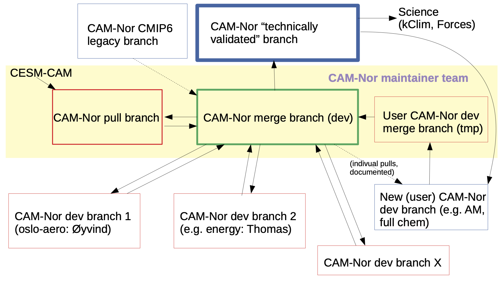

## Contributing to NorESM-CAM repository
We welcome contributions to the CAM-Nor model system, including bug reports and fixes, suggestions/contributions for code improvements, and suggestions for feature enhancements or inclusion of new features.
1. Create an issue to describe the problem and/or suggested fix.
   - In case of feature enhancements or new features, discuss if a separate feature branch should be created.
2. Fork the repository if you wish to contribute code.
3. Understand the branch structure and commit to the right one (see Readme.md for branch explanation) and figure below.
4. Submit changes for review through pull requests.
   - Check that the pull request does not create conflicts. In case of conflicts, try to fix this in the pull request, or ask a maintainer for advice.
   - Changes to the `master` branch should be reviewed by at least one of the maintainers (other than the one submitting the pull request)

Please refer to the [gitHub help pages](https://help.github.com/en/github) for instructions on how to create [issues](https://help.github.com/en/github/managing-your-work-on-github/creating-an-issue), how to [fork](https://help.github.com/en/github/getting-started-with-github/fork-a-repo) or [clone](https://help.github.com/en/github/creating-cloning-and-archiving-repositories/cloning-a-repository) a repository, and how to create a [pull request](https://help.github.com/en/github/collaborating-with-issues-and-pull-requests/creating-a-pull-request).

